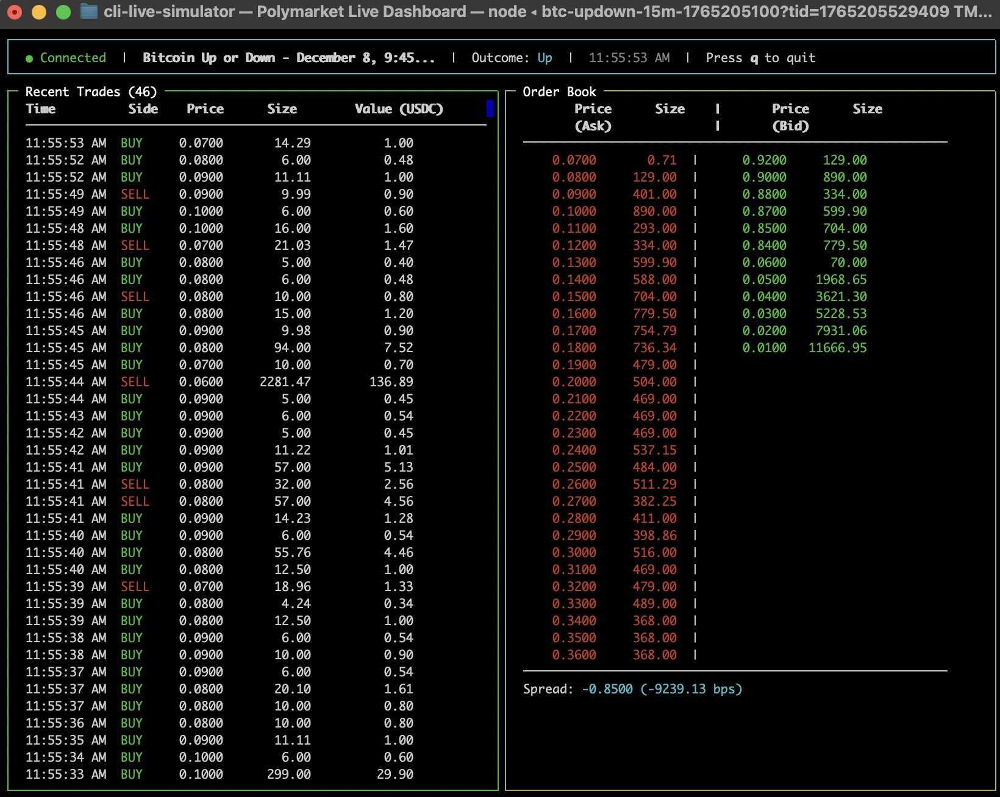

# Polymarket Live CLI Dashboard & Strategy Simulator

Real-time terminal dashboard for Polymarket order books and trades, with built-in strategy simulation capabilities.



## Quick Start

```bash
npm install
npm start -- "https://polymarket.com/event/your-market"
```

## Usage

**Basic usage:**

```bash
npm start -- "https://polymarket.com/event/bitcoin-up-or-down-on-december-8"
```

**Multi-outcome markets:**

```bash
npm start -- "https://polymarket.com/event/fed-decision-in-december" --outcome "25 bps decrease"
npm start -- "https://polymarket.com/event/fed-decision-in-december" --outcome 2
```

## Helper Scripts

```bash
# Get token IDs from URL
npm run get-tokens "https://polymarket.com/event/bitcoin-up-or-down-on-december-8"

# Search markets
npm run find-tokens
npm run find-tokens bitcoin

# 15-minute crypto markets (high volume)
npm run get-15min btc
npm run get-15min eth
```

## Dashboard

The dashboard now includes **Strategy Simulation** features:

- **Top Left:** Market trades (real trades from Polymarket)
- **Bottom Left:** Simulated trades (from your strategies)
- **Top Right:** Live order book (bids/asks with spread)
- **Bottom Right:** Portfolio summary (positions, P&L, current value)
- **Status Bar:** Connection status, market name, outcome

**Controls:** `q`, `ESC`, or `Ctrl+C` to quit

## Strategy Simulator

The dashboard includes a built-in strategy simulator that allows you to test trading strategies with real-time market data.

### Default Strategy: Poll Buy

By default, the simulator runs a **Poll Buy Strategy** that:
- Buys 1 share every 15 seconds
- Uses the current best ask price
- Tracks all positions and calculates P&L

You'll see simulated trades appear in the "Simulated Trades" panel and your portfolio value in the "Portfolio" panel.

### Creating Custom Strategies

See `src/strategy/README.md` for detailed documentation on creating custom strategies.

**Quick Example:**

```typescript
import { BaseStrategy } from "./strategy/base";
import { StrategyContext, StrategyResult } from "./strategy/types";

export class MyStrategy extends BaseStrategy {
  evaluate(context: StrategyContext): StrategyResult {
    // Your strategy logic
    if (shouldBuy) {
      return {
        shouldExecute: true,
        trade: { side: "BUY", size: 1.0 }
      };
    }
    return { shouldExecute: false };
  }
}
```

Then add it in `src/index.ts`:

```typescript
simulator.addStrategy(new MyStrategy({ name: "MyStrategy", enabled: true }));
```

## Development

```bash
npm run dev "https://polymarket.com/event/your-market"  # Development mode
npm run build                                             # Build TypeScript
npm run clean                                             # Clean build
```

## Project Structure

```
src/
├── index.ts              # Entry point
├── types.ts              # TypeScript types
├── websocket/
│   └── client.ts         # WebSocket client
├── ui/
│   └── renderer.ts       # TUI renderer
├── strategy/
│   ├── base.ts          # Base strategy class
│   ├── types.ts         # Strategy types
│   ├── poll-buy-strategy.ts  # Poll buy strategy example
│   └── README.md        # Strategy documentation
├── portfolio/
│   ├── types.ts         # Portfolio types
│   └── portfolio.ts     # Portfolio tracker
└── simulator/
    └── simulator.ts     # Strategy executor
```

## Troubleshooting

**"Waiting for trades..."** - Normal for low-volume markets. Try `npm run get-15min btc` for active markets.

**"Invalid token ID"** - The `tid` URL parameter is NOT a token ID. Use `npm run get-tokens "https://polymarket.com/event/your-market"` first.

## API

- **WebSocket:** `wss://ws-subscriptions-clob.polymarket.com/ws/market`
- **REST:** `https://gamma-api.polymarket.com`
- **Docs:** https://docs.polymarket.com/developers/CLOB/websocket/market-channel

## License

MIT

## Disclaimer

Unofficial tool. Not affiliated with Polymarket. Use at your own risk.
